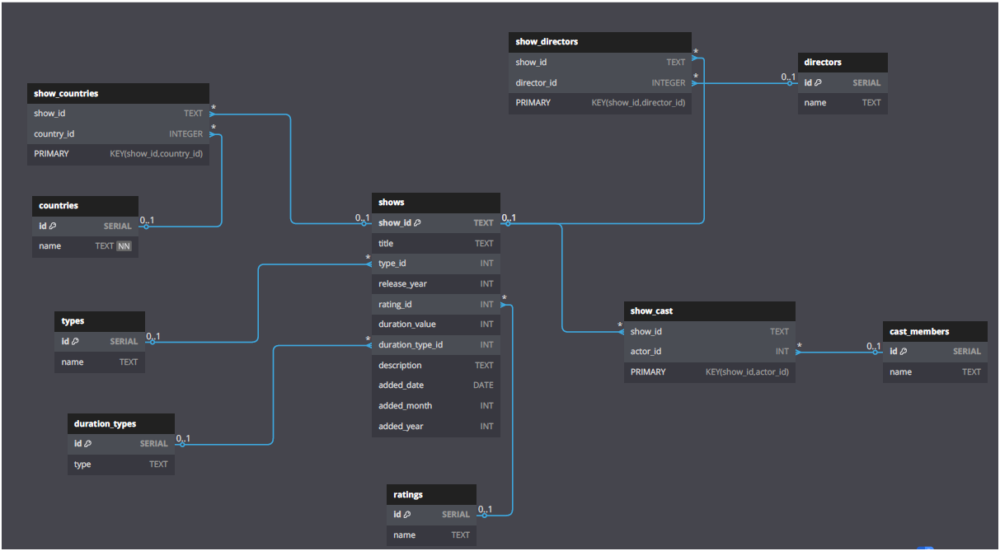
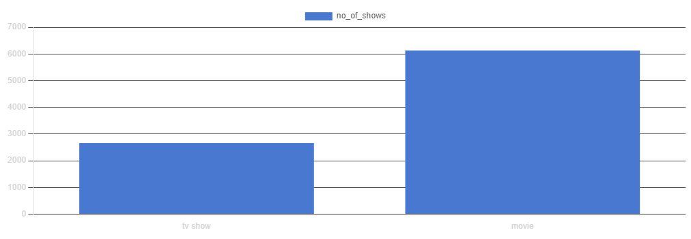
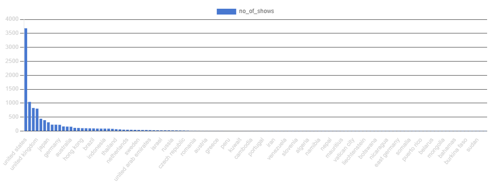
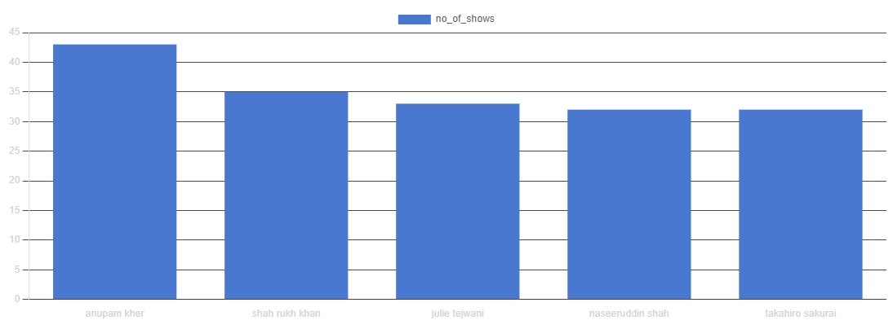

# 📊 Netflix Data Analysis Project Using PostgreSQL


## 🎯 Project Overview

This comprehensive project explores Netflix content through advanced SQL analysis by building a normalized PostgreSQL database from raw CSV data. The project demonstrates expertise in data cleaning, relational modeling, complex SQL querying, and extracting meaningful business insights from streaming platform data.

## 🎯 Objectives

- **Database Design**: Create a fully normalized relational schema from raw CSV data
- **SQL Mastery**: Implement complex queries to solve real-world business problems
- **Data Visualization**: Design clear ER diagrams for database structure understanding
- **Business Intelligence**: Extract actionable insights from Netflix's content library
- **Process Documentation**: Maintain comprehensive documentation of analysis methods

## 🛠️ Tools & Technologies

| Tool | Purpose |
|------|---------|
| **Python (Pandas)** | Data cleaning and preprocessing |
| **PostgreSQL** | Database design and complex querying |
| **pgAdmin 4** | PostgreSQL management and query execution |
| **dbdiagram.io** | Entity-Relationship diagram creation |
| **Git & GitHub** | Version control and project collaboration |
| **Jupyter Notebook** | Exploratory data analysis and validation |

## 📂 Dataset Information

- **Source**: Netflix Movies and TV Shows dataset from Kaggle
- **Original Format**: CSV with denormalized structure and mixed data types
- **Size**: 8,000+ Netflix titles with comprehensive metadata
- **Content**: Movies and TV shows with cast, directors, countries, ratings, and more

### Data Cleaning Process
- ✅ Removed duplicate entries and handled null values
- ✅ Standardized text formatting (whitespace trimming, case normalization)
- ✅ Implemented UTF-8 encoding for character consistency
- ✅ Split comma-separated values into normalized relationships
- ✅ Validated data integrity across all tables

## 🏗️ Database Architecture

### Entity-Relationship Model
The database follows **Third Normal Form (3NF)** principles to eliminate redundancy and ensure data integrity.


*Complete Entity-Relationship diagram showing all table relationships*

### Core Tables Structure

#### Primary Tables
- **`shows`** - Central table containing Netflix titles and metadata
- **`types`** - Content type lookup (Movie, TV Show)
- **`ratings`** - Content rating classifications (PG, R, TV-MA, etc.)
- **`duration_types`** - Duration measurement units (minutes, seasons)

#### Dimension Tables
- **`cast_members`** - Normalized actor information
- **`directors`** - Director information and metadata
- **`countries`** - Country codes and names for production locations

#### Junction Tables (Many-to-Many Relationships)
- **`show_cast`** - Links shows to their cast members
- **`show_directors`** - Maps shows to directors
- **`show_countries`** - Associates shows with production countries

## 📊 Business Intelligence Analysis - 25 SQL Queries

### 🔍 Query 1: How many shows are there in total?

**Problem Statement:** Identify the total number of Netflix shows for basic dataset understanding and to establish a foundational content volume metric.

**Approach:**
- Use the `COUNT(*)` aggregate function on the `shows` table
- Provide an alias `no_of_shows` for clarity in output

**SQL Solution:**
```sql
SELECT COUNT(*) AS NO_OF_SHOWS 
FROM SHOWS;
```

---

### 🎬 Query 2: List all movies released in the year 2020

**Problem Statement:** Identify all Netflix movies (not TV shows) that were released in the year 2020 for content acquisition analysis.

**Approach:**
- Perform an INNER JOIN between the `shows` and `types` tables
- Filter results to only include rows where `type = 'movie'`
- Apply a condition to restrict `release_year = 2020`

**SQL Solution:**
```sql
SELECT S.TITLE
FROM SHOWS S
INNER JOIN TYPES T ON S.TYPE_ID = T.ID
WHERE T.NAME = 'MOVIE' 
  AND S.RELEASE_YEAR = 2020;
```

---

### 📊 Query 3: Find the total number of shows for each content type

**Problem Statement:** Determine how many shows exist in each content category such as Movies and TV Shows to analyze the distribution of content types.

**Approach:**
- Perform an INNER JOIN between the `shows` and `types` tables
- Group the results by type and use COUNT to determine total shows per type
- Also consider alternative version without JOIN for comparison

**SQL Solution:**
```sql
SELECT T.NAME AS TYPE_OF_SHOW, COUNT(*) AS NO_OF_SHOWS 
FROM SHOWS S
INNER JOIN TYPES T ON S.TYPE_ID = T.ID
GROUP BY T.NAME;

-- ALTERNATE VERSION WITHOUT JOIN
SELECT TYPE_ID AS SHOW_TYPE, COUNT(*) AS NO_OF_SHOWS 
FROM SHOWS 
GROUP BY TYPE_ID;
```



---

### ⭐ Query 4: List distinct ratings available in the dataset

**Problem Statement:** Retrieve all unique content ratings to understand the classification of shows available on Netflix.

**Approach:**
- Query the `ratings` table directly
- Use `DISTINCT` to return only unique values

**SQL Solution:**
```sql
SELECT DISTINCT NAME  
FROM RATINGS;
```

---

### 🌍 Query 5: Number of shows per country

**Problem Statement:** Determine content production by country to assess international contributions to Netflix's library.

**Approach:**
- Join the `shows`, `show_countries`, and `countries` tables
- Group by `country name` and count associated shows
- Order by show count in descending order

**SQL Solution:**
```sql
SELECT C.NAME AS COUNTRY_NAME, COUNT(*) AS NO_OF_SHOWS 
FROM SHOWS S 
INNER JOIN SHOW_COUNTRIES SC ON S.SHOW_ID = SC.SHOW_ID 
INNER JOIN COUNTRIES C ON SC.COUNTRY_ID = C.ID 
GROUP BY C.NAME 
ORDER BY NO_OF_SHOWS DESC;
```



---

### 🎭 Query 6: Directors with the most shows

**Problem Statement:** Identify directors who have contributed the most content to Netflix.

**Approach:**
- Join `directors` and `show_directors` tables
- Group by `director name`
- Count shows and sort in descending order, excluding unknowns

**SQL Solution:**
```sql
SELECT NAME AS DIRECTOR_NAME, COUNT(*) AS NO_OF_SHOWS 
FROM DIRECTORS 
INNER JOIN SHOW_DIRECTORS ON ID = DIRECTOR_ID 
WHERE NAME NOT ILIKE 'UNKNOWN' 
GROUP BY NAME 
ORDER BY NO_OF_SHOWS DESC;
```

---

### 👥 Query 7: Top 5 most-featured actors

**Problem Statement:** List the top five actors based on the number of Netflix shows they appear in.

**Approach:**
- Join `cast_members` and `show_cast` tables
- Count appearances for each actor and group by name
- Sort by count and limit results to top 5

**SQL Solution:**
```sql
SELECT NAME AS ACTOR_NAME, COUNT(*) AS NO_OF_SHOWS 
FROM CAST_MEMBERS 
INNER JOIN SHOW_CAST ON ID = ACTOR_ID 
WHERE NAME NOT ILIKE 'UNKNOWN' 
GROUP BY NAME 
ORDER BY NO_OF_SHOWS DESC 
LIMIT 5;
```



---

### 📺 Query 8: Countries producing most TV Shows

**Problem Statement:** Determine which countries have produced the most TV shows on Netflix.

**Approach:**
- Join `countries`, `show_countries`, `shows`, and `types` tables
- Filter for type 'TV Show' and valid country names
- Group by country and sort by show count

**SQL Solution:**
```sql
SELECT C.NAME AS COUNTRY_NAME, COUNT(*) AS NO_OF_TV_SHOWS 
FROM COUNTRIES C 
INNER JOIN SHOW_COUNTRIES SC ON C.ID = SC.COUNTRY_ID
INNER JOIN SHOWS S ON S.SHOW_ID = SC.SHOW_ID
INNER JOIN TYPES T ON S.TYPE_ID = T.ID 
WHERE C.NAME NOT ILIKE 'UNKNOWN' AND T.NAME ILIKE 'TV SHOW' 
GROUP BY C.NAME 
ORDER BY NO_OF_TV_SHOWS DESC;
```

---

### ⏱️ Query 9: Average duration of movies by rating

**Problem Statement:** Calculate the average duration of movies grouped by their ratings.

**Approach:**
- Join the `shows`, `types`, `ratings`, and `duration_types` tables
- Filter to include only movie-type shows with duration in minutes
- Group by rating name and compute the average duration

**SQL Solution:**
```sql
SELECT R.NAME AS TYPE_OF_RATING,
       (CONCAT(CAST(ROUND(AVG(S.DURATION_VALUE), 3) AS TEXT), ' min')) AS AVG_DURATION_OF_MOVIES_IN_THIS_RATING
FROM SHOWS S
INNER JOIN TYPES T ON S.TYPE_ID = T.ID
INNER JOIN RATINGS R ON S.RATING_ID = R.ID
INNER JOIN DURATION_TYPES DT ON S.DURATION_TYPE_ID = DT.ID
WHERE T.NAME ILIKE 'MOVIE' AND DT.TYPE ILIKE 'MIN'
GROUP BY R.NAME;
```

---

### 📅 Query 10: Number of shows added each year

**Problem Statement:** Track Netflix's content growth by counting the number of shows added per year.

**Approach:**
- Group the `shows` table by `added_year`
- Use `COUNT(*)` to find the total number of shows added each year

**SQL Solution:**
```sql
SELECT ADDED_YEAR AS YEAR_ADDED, COUNT(*) AS NO_OF_SHOWS_ADDED_IN_THAT_YEAR
FROM SHOWS
GROUP BY ADDED_YEAR;
```

---

### 🎭 Query 11: Actors in both Movies and TV Shows

**Problem Statement:** Find actors who have worked in both movies and TV shows.

**Approach:**
- Join `cast_members`, `show_cast`, `shows`, and `types` tables
- Group by actor name and filter those who have multiple content types using `HAVING COUNT(DISTINCT type) > 1`

**SQL Solution:**
```sql
SELECT CM.NAME AS ACTOR_NAME
FROM CAST_MEMBERS CM
JOIN SHOW_CAST SC ON CM.ID = SC.ACTOR_ID
JOIN SHOWS S ON S.SHOW_ID = SC.SHOW_ID
JOIN TYPES T ON S.TYPE_ID = T.ID
WHERE CM.NAME NOT ILIKE 'UNKNOWN'
GROUP BY CM.NAME
HAVING COUNT(DISTINCT T.NAME) > 1;
```

---

### 👥 Query 12: Shows with more than 3 actors

**Problem Statement:** Identify shows that feature more than three distinct actors.

**Approach:**
- Join `shows` and `show_cast` tables
- Group by `show_id` and use `HAVING COUNT(DISTINCT actor_id) >= 3`

**SQL Solution:**
```sql
SELECT S.TITLE AS SHOW, COUNT(DISTINCT SC.ACTOR_ID) AS NO_OF_ACTORS
FROM SHOWS AS S
JOIN SHOW_CAST AS SC ON S.SHOW_ID = SC.SHOW_ID
GROUP BY S.SHOW_ID
HAVING COUNT(DISTINCT SC.ACTOR_ID) >= 3
ORDER BY NO_OF_ACTORS DESC;
```

---

### 🎬 Query 13: Shows by prolific directors (more than 5 shows)

**Problem Statement:** List all shows directed by directors who have directed more than five Netflix shows.

**Approach:**
- Join `shows`, `show_directors`, and `directors` tables
- Filter directors with more than 5 shows using a subquery in `WHERE` clause

**SQL Solution:**
```sql
SELECT S.TITLE AS SHOW_NAME, D.NAME AS DIRECTOR_NAME
FROM SHOWS AS S
JOIN SHOW_DIRECTORS AS SD ON S.SHOW_ID = SD.SHOW_ID
JOIN DIRECTORS AS D ON SD.DIRECTOR_ID = D.ID
WHERE D.NAME NOT ILIKE 'UNKNOWN'
  AND D.ID IN (
    SELECT DIRECTOR_ID
    FROM SHOW_DIRECTORS
    GROUP BY DIRECTOR_ID
    HAVING COUNT(DISTINCT SHOW_ID) > 5
);
```

---

### 📈 Query 14: Most common release year for shows

**Problem Statement:** Determine the release year in which the highest number of shows were launched on Netflix.

**Approach:**
- Group the `shows` table by the `release_year` column
- Count the number of shows for each year using `COUNT(*)`
- Use `ORDER BY` in descending order and limit the result to 1

**SQL Solution:**
```sql
SELECT RELEASE_YEAR, COUNT(*) AS NO_OF_SHOWS_RELEASED
FROM SHOWS
GROUP BY RELEASE_YEAR
ORDER BY COUNT(*) DESC
LIMIT 1;
```

---

### 🅰️ Query 15: Shows with actors whose names start with 'A'

**Problem Statement:** Retrieve all shows that feature actors whose names start with the letter 'A'.

**Approach:**
- Join `shows`, `show_cast`, and `cast_members` tables
- Filter actors using the `ILIKE 'A%'` condition to match names starting with 'A'
- Select show titles and corresponding actor names

**SQL Solution:**
```sql
SELECT S.TITLE, CM.NAME AS ACTOR_NAME
FROM SHOWS AS S
JOIN SHOW_CAST AS SC ON S.SHOW_ID = SC.SHOW_ID
JOIN CAST_MEMBERS AS CM ON SC.ACTOR_ID = CM.ID
WHERE CM.NAME ILIKE 'A%';
```

---

### 🏆 Query 16: Rank shows by release year within each country

**Problem Statement:** Generate a ranking of shows within each country based on their release years.

**Approach:**
- Join `shows`, `show_countries`, and `countries` tables
- Use the `DENSE_RANK()` window function to rank shows within each country
- Exclude entries with unknown country names

**SQL Solution:**
```sql
SELECT C.NAME, S.TITLE, S.RELEASE_YEAR,
       DENSE_RANK() OVER (PARTITION BY C.NAME ORDER BY RELEASE_YEAR) AS RANK
FROM SHOWS AS S
INNER JOIN SHOW_COUNTRIES AS SC ON S.SHOW_ID = SC.SHOW_ID
INNER JOIN COUNTRIES AS C ON SC.COUNTRY_ID = C.ID
WHERE C.NAME NOT ILIKE 'UNKNOWN'
ORDER BY C.NAME, S.RELEASE_YEAR;
```

---

### 🎭 Query 17: Shows directed and acted by the same person

**Problem Statement:** Identify shows where the same individual served both as a director and actor.

**Approach:**
- Create a CTE to join multiple tables
- Compare `director name` and `actor name` within the same row
- Select only those rows where both names match

**SQL Solution:**
```sql
WITH directors_joined AS (
    SELECT S.SHOW_ID, S.TITLE, D.NAME AS DIRECTOR_NAME, CM.NAME AS ACTOR_NAME
    FROM SHOWS AS S
    INNER JOIN SHOW_DIRECTORS AS SD ON S.SHOW_ID = SD.SHOW_ID
    INNER JOIN DIRECTORS AS D ON SD.DIRECTOR_ID = D.ID
    INNER JOIN SHOW_CAST AS SC ON S.SHOW_ID = SC.SHOW_ID
    INNER JOIN CAST_MEMBERS AS CM ON SC.ACTOR_ID = CM.ID
    WHERE CM.NAME NOT ILIKE 'UNKNOWN' AND D.NAME NOT ILIKE 'UNKNOWN'
)
SELECT SHOW_ID, TITLE, DIRECTOR_NAME AS DIRECTOR_AND_ACTOR
FROM directors_joined
WHERE DIRECTOR_NAME = ACTOR_NAME;
```

---

### 📅 Query 18: Shows added in the same month across different years

**Problem Statement:** List all shows that were added in the same calendar month across multiple years.

**Approach:**
- Extract the month and year from the `added_date` column using `TO_CHAR`
- Create a CTE to structure the data with month and year split
- Display all records sorted by month and year

**SQL Solution:**
```sql
WITH dates AS (
    SELECT SHOW_ID, TITLE,
           TO_CHAR(ADDED_DATE, 'MM') AS MONTH,
           TO_CHAR(ADDED_DATE, 'YYYY') AS YEAR
    FROM SHOWS
)
SELECT *
FROM dates
ORDER BY MONTH, YEAR;
```

---

### 🌟 Query 19: Top 3 most frequently cast actors per country

**Problem Statement:** Find the top three actors most frequently featured in Netflix content from each country.

**Approach:**
- Join multiple tables to get actor-country relationships
- Use `COUNT()` to compute the number of appearances per actor-country pair
- Apply `DENSE_RANK()` over each country partition
- Filter to only include the top 3 actors per country

**SQL Solution:**
```sql
WITH cte AS (
    SELECT CM.NAME AS ACTOR_NAME, C.NAME AS COUNTRY,
           COUNT(SCO.SHOW_ID) AS NO_OF_SHOWS,
           DENSE_RANK() OVER(PARTITION BY C.NAME ORDER BY COUNT(SCO.SHOW_ID) DESC) AS RANK
    FROM SHOW_CAST AS SC
    INNER JOIN CAST_MEMBERS AS CM ON SC.ACTOR_ID = CM.ID
    INNER JOIN SHOW_COUNTRIES AS SCO ON SC.SHOW_ID = SCO.SHOW_ID
    INNER JOIN COUNTRIES AS C ON SCO.COUNTRY_ID = C.ID
    WHERE C.NAME NOT ILIKE 'UNKNOWN' AND CM.NAME NOT ILIKE 'UNKNOWN'
    GROUP BY COUNTRY, ACTOR_NAME
)
SELECT * FROM CTE WHERE RANK <= 3;
```

---

### ⏱️ Query 20: Top 10 countries by total movie duration

**Problem Statement:** Identify countries that have produced the longest total duration of movies.

**Approach:**
- Join multiple tables to get country-movie duration relationships
- Filter for movie-type shows with durations measured in minutes
- Aggregate total durations by country and order descending
- Limit the result to the top 10

**SQL Solution:**
```sql
SELECT C.NAME AS COUNTRY_NAME, SUM(S.DURATION_VALUE) || ' min' AS TOTAL_MOVIES_DURATION_LENGTH
FROM SHOWS S
INNER JOIN DURATION_TYPES DT ON S.DURATION_TYPE_ID = DT.ID
INNER JOIN SHOW_COUNTRIES SC ON SC.SHOW_ID = S.SHOW_ID
INNER JOIN COUNTRIES C ON C.ID = SC.COUNTRY_ID
INNER JOIN TYPES T ON S.TYPE_ID = T.ID
WHERE DT.TYPE = 'min' AND C.NAME NOT ILIKE 'unknown'
GROUP BY C.NAME
ORDER BY SUM(S.DURATION_VALUE)::NUMERIC DESC
LIMIT 10;
```

---

### 🎬 Query 21: One-hit directors (only one show)

**Problem Statement:** Find directors who have only one show in the entire Netflix database.

**Approach:**
- Use a CTE to get `director_id`s with exactly one show
- Join the result back with the `directors` table to fetch names
- Exclude unknown directors and sort alphabetically

**SQL Solution:**
```sql
WITH CTE AS (
    SELECT DIRECTOR_ID
    FROM SHOW_DIRECTORS
    GROUP BY DIRECTOR_ID
    HAVING COUNT(DISTINCT SHOW_ID) = 1
)
SELECT D.NAME
FROM DIRECTORS AS D
INNER JOIN CTE AS C ON D.ID = C.DIRECTOR_ID
WHERE D.NAME NOT ILIKE 'UNKNOWN'
ORDER BY D.NAME;
```

---

### 🏆 Query 22: Movies with longest duration per release year

**Problem Statement:** Identify the movie with the longest runtime for each release year.

**Approach:**
- Filter `shows` for entries where `duration_type` is in minutes
- Use a CTE and apply `DENSE_RANK()` partitioned by `release_year`
- Select entries ranked 1 in each year

**SQL Solution:**
```sql
WITH CTE AS (
    SELECT S.TITLE, S.DURATION_VALUE, S.RELEASE_YEAR,
           DENSE_RANK() OVER(PARTITION BY S.RELEASE_YEAR ORDER BY S.DURATION_VALUE DESC) AS RANK
    FROM SHOWS S
    INNER JOIN DURATION_TYPES DT ON S.DURATION_TYPE_ID = DT.ID
    WHERE DT.TYPE ILIKE 'min'
)
SELECT TITLE AS MOVIE, DURATION_VALUE || ' min' AS DURATION_OF_MOVIE, RELEASE_YEAR
FROM CTE
WHERE RANK = 1;
```

---

### 🤝 Query 23: Actors in multiple shows with the same director

**Problem Statement:** Identify actor-director pairs who have collaborated on more than one show.

**Approach:**
- Join multiple tables to get actor-director relationships
- Group by both director and actor names
- Use `HAVING COUNT(*) > 1` to filter those appearing in multiple shows together
- Exclude unknown entries

**SQL Solution:**
```sql
SELECT D.NAME AS DIRECTOR, CM.NAME AS ACTOR, COUNT(S.SHOW_ID) AS NO_OF_SHOWS_TOGETHER
FROM SHOWS AS S
INNER JOIN SHOW_DIRECTORS AS SD ON S.SHOW_ID = SD.SHOW_ID
INNER JOIN DIRECTORS AS D ON SD.DIRECTOR_ID = D.ID
INNER JOIN SHOW_CAST AS SC ON S.SHOW_ID = SC.SHOW_ID
INNER JOIN CAST_MEMBERS AS CM ON SC.ACTOR_ID = CM.ID
WHERE D.NAME NOT ILIKE 'UNKNOWN' AND CM.NAME NOT ILIKE 'UNKNOWN'
GROUP BY D.NAME, CM.NAME
HAVING COUNT(S.SHOW_ID) > 1
ORDER BY NO_OF_SHOWS_TOGETHER DESC;
```

---

### 🛠️ Query 24: Procedure to get shows by added year

**Problem Statement:** Create a stored procedure that returns all shows added to Netflix in a given year.

**Approach:**
- Create a PL/pgSQL procedure that accepts a target year as input
- Use a `FOR` loop to iterate through and print shows that match the input year
- Filter using `TO_CHAR(added_date, 'YYYY')` for string comparison

**SQL Solution:**
```sql
CREATE OR REPLACE PROCEDURE get_shows_by_year(target_year INT)
LANGUAGE plpgsql
AS $
DECLARE
    record RECORD;
BEGIN
    RAISE NOTICE 'Shows added in %:', target_year;

    FOR record IN
        SELECT title, added_date
        FROM shows
        WHERE TO_CHAR(added_date, 'YYYY') = target_year::TEXT
    LOOP
        RAISE NOTICE 'Title: %, Added Date: %', record.title, record.added_date;
    END LOOP;
END;
$;

CALL get_shows_by_year(2020);
```

---

### 🔄 Query 25: Shows with duplicate actor entries

**Problem Statement:** Find shows in which the same actor appears multiple times due to data entry duplications or multiple roles.

**Approach:**
- Join `show_cast`, `shows`, and `cast_members`
- Group by show title and actor name
- Use `HAVING COUNT(*) > 1` to detect repeated entries
- Order by appearance count in descending order

**SQL Solution:**
```sql
SELECT 
    S.TITLE AS SHOW_TITLE,
    CM.NAME AS ACTOR_NAME,
    COUNT(*) AS APPEARANCES
FROM 
    SHOW_CAST SC
JOIN SHOWS S ON SC.SHOW_ID = S.SHOW_ID
JOIN CAST_MEMBERS CM ON SC.ACTOR_ID = CM.ID
GROUP BY 
    S.TITLE, CM.NAME
HAVING 
    COUNT(*) > 1
ORDER BY 
    APPEARANCES DESC;
```

## 🔍 Key Insights Discovered

### Content Distribution
- **Total Shows**: 8,800+ Netflix titles analyzed
- **Content Split**: Movies dominate the platform with significant TV show presence
- **Global Reach**: Content spans 100+ countries worldwide

### Production Insights
- **Top Producing Countries**: United States leads, followed by India and United Kingdom
- **Peak Release Year**: 2018 saw the highest number of content releases
- **Duration Patterns**: Movie lengths vary significantly by rating classification

### Talent Analysis
- **Prolific Directors**: Several directors have 10+ shows in the Netflix catalog
- **Versatile Actors**: Many performers work across both movies and TV shows
- **Collaboration Networks**: Strong director-actor partnerships identified


## 🚀 Getting Started

### Prerequisites
```bash
- PostgreSQL 12+
- pgAdmin 4 (optional, for GUI management)
- Python 3.8+ with Pandas library
- Git for version control
```

### Installation & Setup

1. **Clone the Repository**
```bash
git clone https://github.com/yourusername/netflix-data-analysis-postgresql.git
cd netflix-data-analysis-postgresql
```

2. **Database Setup**
```bash
# Create database
createdb netflix_analysis

#  table creation
open database_creation file and execute all .

# Import cleaned data
 for some tables import data from the cleaned data set given as prescribed in the insertion file .
```

3. **Execute Analysis Queries**
```bash
# Run all business queries
Now Run all queries and Analyze soultions
```

## 📁 Project Structure

```
Netflix-Data-Analysis-Using-PostgreSql/
│
├── README.md                          # Project documentation
├── er_diagram.png                            # Entity-Relationship diagram
├── data/
│   ├── netflix_raw_original.csv              # Original dataset
│   └── netflix_cleaned.csv          # Processed dataset
|   └──countries.csv                 #cleaned countries dataset
|   └──casts.csv                     # cleaned cast_members
|   └──directors.csv                  #cleaned directors  
|
|
├── sql/
│   ├── database_creation.sql            # DDL statements
│   ├── insertion_into_database.sql              # Data import scripts
│   └── querying_new.sql             # 25 analytical queries
├── notebooks/
│   └── data_cleaning_netfix.ipynb          # Pandas preprocessing
├── images/
│   ├── 1.png               # Visualization outputs
│   └── 2.png                      # Analysis charts
|   └── 7.png   
└── docs/
    └── project_documentation.pdf    # Comprehensive documentation
```

## 🎓 Skills Demonstrated

### Technical Competencies
- **Advanced SQL**: Complex joins, subqueries, window functions, CTEs
- **Database Design**: Normalization, ER modeling, constraint implementation
- **Data Engineering**: ETL processes, data validation, quality assurance
- **Python Programming**: Pandas for data manipulation and cleaning
- **Performance Optimization**: Query tuning and indexing strategies

### Analytical Capabilities
- **Business Intelligence**: Converting data into actionable insights
- **Statistical Analysis**: Trend identification and pattern recognition
- **Data Storytelling**: Presenting complex findings in understandable formats
- **Problem-Solving**: Breaking down business questions into technical solutions

## 📊 Sample Query Results

### Top 5 Countries by Content Production
| Country | Number of Shows |
|---------|-----------------|
| United States | 2,818 |
| India | 972 |
| United Kingdom | 419 |
| Japan | 245 |
| South Korea | 199 |

### Content Type Distribution
| Type | Count | Percentage |
|------|-------|------------|
| Movie | 6,131 | 69.6% |
| TV Show | 2,676 | 30.4% |

## 🔮 Future Enhancements

- **Recommendation Engine**: Implement collaborative filtering algorithms
- **Sentiment Analysis**: Analyze viewer reviews and ratings
- **Time Series Forecasting**: Predict content addition patterns
- **Interactive Dashboard**: Create web-based visualization interface
- **API Integration**: Real-time data updates from Netflix API
- **Machine Learning**: Content categorization and trend prediction

## 🤝 Contributing

Contributions are welcome! Please feel free to submit pull requests or open issues for:
- Additional analytical queries
- Performance optimizations
- Documentation improvements
- Visualization enhancements

## 📞 Contact & Connect

- **LinkedIn**: [https://www.linkedin.com/in/trinadh-011a2b274/]
- **Email**: [nimmalapuditrinadh@gmail.com]


## 🙏 Acknowledgments

- Netflix for providing comprehensive streaming data
- Kaggle community for dataset availability and insights
- PostgreSQL documentation and community support
- Open-source tools and libraries that made this analysis possible

---

⭐ **If you found this project helpful, please give it a star!** ⭐

*This project demonstrates the power of SQL and relational databases in solving real-world business problems in the entertainment industry.*
